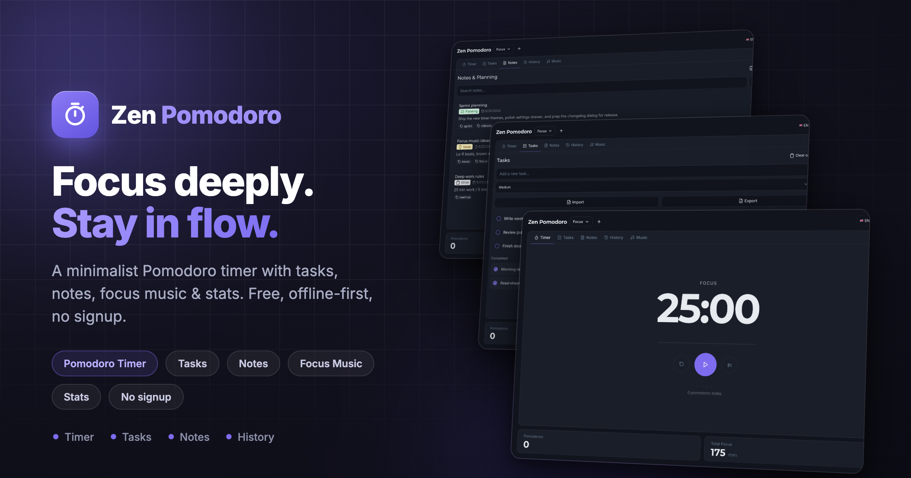

# Zen Pomodoro



> A minimalist Pomodoro timer with tasks, notes, focus music & stats. Free, offline-first, no signup.

## Project info

**Repository**: https://github.com/Foodhy/zen-pomodoro

## How can I edit this code?

Work locally using your own IDE. The only requirement is having Node.js & npm installed — [install with nvm](https://github.com/nvm-sh/nvm#installing-and-updating).

Follow these steps:

```sh
# Step 1: Clone the repository.
git clone https://github.com/Foodhy/zen-pomodoro.git

# Step 2: Navigate to the project directory.
cd zen-pomodoro

# Step 3: Install the necessary dependencies.
npm i

# Step 4: Start the development server with auto-reloading and an instant preview.
npm run dev
```

You can also edit files directly in GitHub or use GitHub Codespaces.

## What technologies are used for this project?

This project is built with:

- Vite
- TypeScript
- React
- shadcn-ui
- Tailwind CSS

## How can I deploy this project?

Build with `npm run build` and deploy the generated `dist/` folder to any static host (Netlify, Vercel, GitHub Pages, etc.).

## I want to use a custom domain - is that possible?

Yes — configure a custom domain on your chosen static host. For Netlify see [Custom domains](https://docs.netlify.com/domains-https/custom-domains/).
